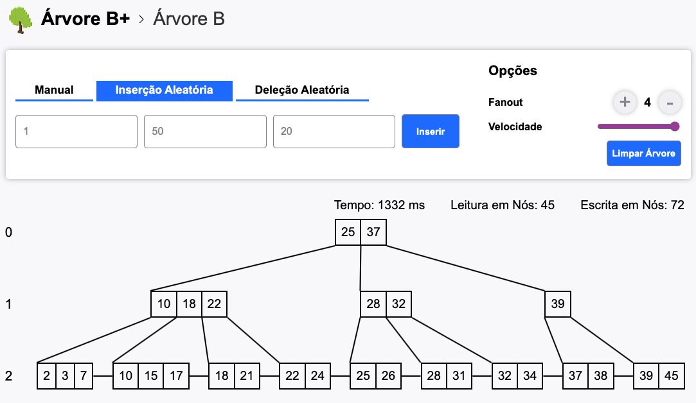
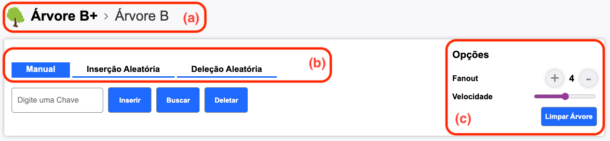

# Manual do Usuário

## Sobre

Este projeto permite a visualização de árvores B e árvores B+. É possível inserir, deletar e buscar chaves manualmente. Além disso, é possível realizar inserção e deleção de valores de forma aleatória.

Caso queira somente visualizar o projeto, sem ter que baixar, basta abrir o [site do projeto](https://arvores.izaias.me/) por meio de qualquer navegador.

## Como Baixar?

Inicialmente, o repositório do projeto pode ser baixado em sua máquina usando o comando

```bash
# Caso use HTTPS
git clone https://github.com/izaiasmachado/TrabalhoSGBD-2023_1.git

# Caso use SSH
git clone git@github.com:izaiasmachado/TrabalhoSGBD-2023_1.git
```

Entre na pasta do projeto

```bash
cd TrabalhoSGBD-2023_1.git
```

Para iniciar o projeto, abra o arquivo `index.html` localizado na raiz do projeto. Você pode utilizar qualquer navegador para isso.

## Como usar?

Abaixo temos um exemplo de visualização de uma árvore B+, que foi criada por meio de uma inserção aleatória de vinte números.



A próxima imagem destaca em vermelho algumas partes da interface para melhor explicação.

Em (a), é apresentado que a árvore B+ está sendo exibida. Ao clicar em árvore B, a visualização é alternada para essa árvore. Observe que ao fazer isso, todos os nós da visualização serão perdidos.

Já em (b), é possível alternar entre os modos de inserção/deleção de dados. Com o fundo azul nessa seção, é destacado que a opção atual é a de inserção. Nesse modo, você pode inserir, buscar e deletar elementos únicos. Os elementos podem ser tanto texto quanto números.

Ainda em (b), caso seja escolhida a inserção aleatória, essa seção ficará destacada em azul, assim como na figura. Nesse caso, é possível definir um intervalo de valores para gerar números aleatórios, bem como a quantidade de números a serem gerados. É importante destacar que não são adicionados números repetidos em uma mesma inserção aleatória.

Além disso, a opção de deleção aleatória permite escolher uma quantidade de elementos, e os elementos presentes na árvore são escolhidos aleatoriamente para serem deletados.

Em (c), é possível escolher o fanout da árvore. Ao alterar o valor do fanout, os elementos inseridos serão perdidos. É possível também limpar a árvore, o que consiste em remover todos os elementos já inseridos. A velocidade, destacada por um controle deslizante em (c), define a velocidade com que as ações são exibidas na tela. Isso ocorre porque a árvore mostra cada passo de forma interativa.


